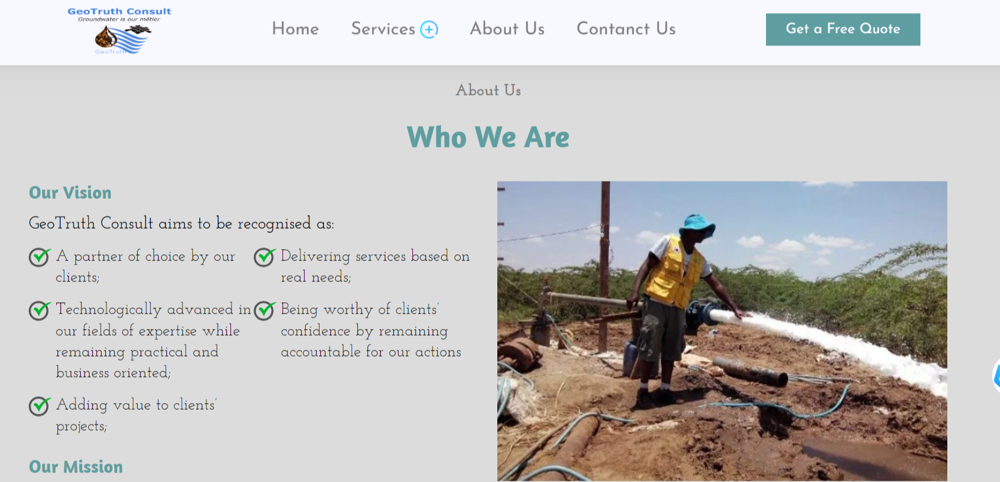

# Borehole Drilling Company Website

## Technologies Used:
 
 * React
 * Email Js

### Home Page

### About Page

### Contanct Form

This repository contains the source code for a Borehole Drilling website, implemented as a single page application (SPA) using REACT.

 ### Silent Features :

* Responsive Design.
* Portfolio Template.
* Unique and Dynamic Design.
* Contains HOME, ABOUT, SERVICES, CLASSES, SCHEDULE ,PRICE and many other sections.

### Installation
To run the gym website locally as a single page application, follow these steps:
- Clone this repository: git clone `https://github.com/DeveloperWilliams/boreholeWebsite.git`
- Navigate to the project directory: `cd boreholewebsite`
- Navigate to the project directory: `npm install`
- Navigate to the project directory: `npm install react-router-dom`

### Usage
Once the website is running, the  sections will be prominently displayed at the top of the page. Users can engage with these section by:
- Reading the compelling headline and understanding the main message or value proposition of the company.
- Watching an engaging video or viewing an attractive image that showcases the gym's atmosphere and facilities.
- Clicking on the call-to-action buttons to perform desired actions, such as exploring classes, signing up for a membership, or contacting the company.
- Scrolling down to discover more content on the website.
The single page application design ensures a seamless and interactive user experience by dynamically loading content without page refreshes, enhancing navigation and responsiveness.

### Customization

You can customize the hero section to match your website branding and messaging. 

Feel free to customize the code and design to align with your companys' unique identity and goals.

### Contributing

If you find any issues with the website or have suggestions for improvement, please feel free to submit a pull request or open an issue in this repository. Your contributions are welcome!

